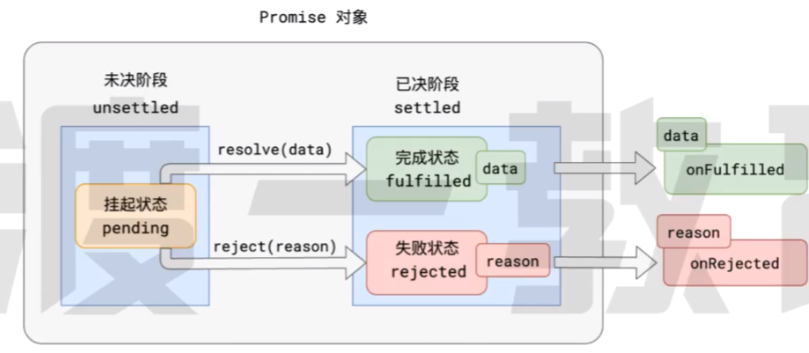

- 没有Promise之前的世界
  - function(event,成功的回调,失败的回调){}
  - 产生回调地狱

- Promise规范
  - Promise A+ 规范   (Promise A  规范被抛弃)
    - 1. 所有异步场景,可以看作一个异步任务,每个异步任务,在JS中应该表示为一个**对象**,称之为 **Promise对象**
    - 2. 每个任务对象,都应该有两个阶段 三个状态
        - unsettled  --> settled
        - pedding  -->  fulfilled  or  rejected
        - 其中简单的逻辑就不说了,状态确定后,无法被改变
    - 3. pedding --> fulfilled(称为 resolve)  pedding --> rejected(称为 reject)
    任务成功,有一个相关数据;任务失败,**可能**有一个失败原因
    - 4.针对任务的后续处理,成功状态称其为  onFulfilled ||  失败状态称其为  onRejected
    
